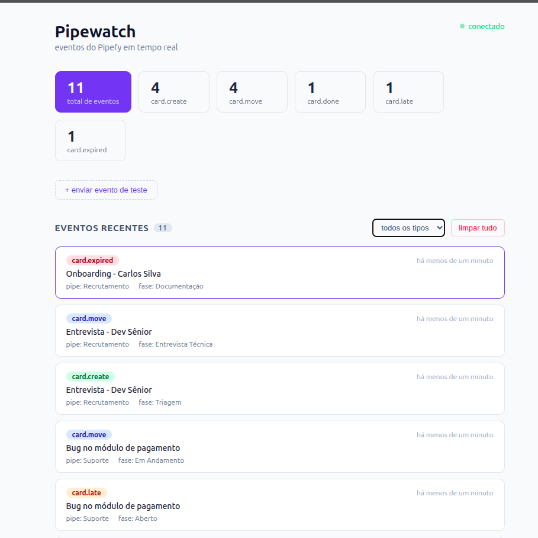
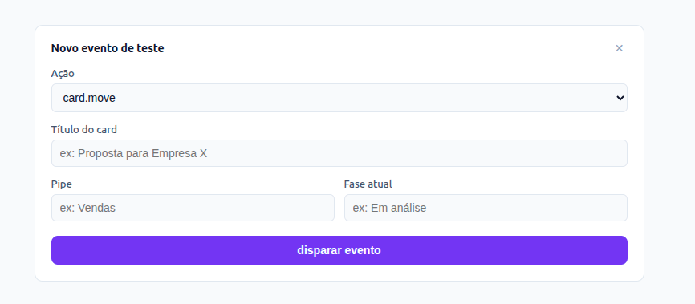
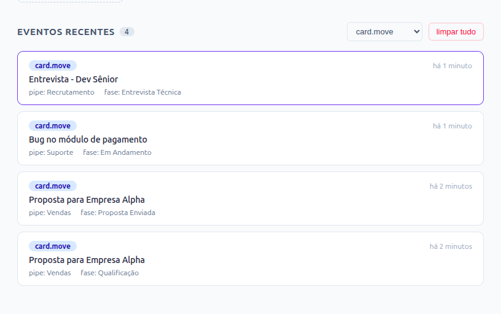

# Pipewatch

Painel em tempo real para eventos do Pipefy. Cada vez que um card é movido, criado ou concluído no Pipefy, o evento aparece no painel em menos de um segundo — sem polling, sem refresh.

## Interface

**Painel principal** — eventos chegando via SSE com contadores por tipo de ação. O indicador no canto superior direito mostra o status da conexão em tempo real.



**Formulário de teste** — dispara eventos diretamente pela interface, sem precisar de curl ou de uma conta no Pipefy. Útil para demonstrações e desenvolvimento local.



**Filtro por ação** — filtra a lista por tipo de evento (`card.move`, `card.create`, etc.) sem recarregar a página. O filtro também se aplica aos eventos que chegam via SSE enquanto a conexão está aberta.



## Arquitetura

```
Pipefy ──webhook──► Flask (Cloud Run)
                        │
                        ├── PostgreSQL (Cloud SQL)
                        │
                        └── SSE ──► React (Cloud Run)
```

O backend valida a assinatura HMAC do webhook, persiste o evento no PostgreSQL e transmite para os clientes conectados via **Server-Sent Events**. O frontend mantém uma conexão SSE aberta e atualiza o estado em tempo real sem recarregar a página.

SSE foi escolhido sobre WebSocket porque o fluxo é unidirecional (servidor → cliente) e funciona sem infraestrutura extra no Cloud Run.

## Stack

| Camada | Tecnologia |
|---|---|
| Backend | Python · Flask · SQLAlchemy · Flask-Migrate |
| Banco | PostgreSQL 16 |
| Frontend | React 18 · TypeScript · Vite |
| Deploy | Google Cloud Run · Cloud Build · Artifact Registry |
| Local | Docker Compose |

## Rodando localmente

**Pré-requisitos:** Docker e Docker Compose instalados.

```bash
git clone https://github.com/seu-usuario/pipewatch.git
cd pipewatch

# sobe banco + backend + frontend
docker compose up --build
```

| Serviço | URL |
|---|---|
| Frontend | http://localhost:5173 |
| Backend API | http://localhost:5000/api/events |
| Webhook endpoint | http://localhost:5000/webhook/pipefy |

Para testar localmente sem o Pipefy, use o script de simulação:

```bash
curl -X POST http://localhost:5000/webhook/pipefy \
  -H "Content-Type: application/json" \
  -d '{
    "data": {
      "action": "card.move",
      "card": {
        "id": "123",
        "title": "Revisar proposta",
        "pipe": { "id": "456", "name": "Vendas" },
        "current_phase": { "id": "789", "name": "Em análise" }
      }
    }
  }'
```

## Variáveis de ambiente

Copie `.env.example` para `.env` e preencha:

```bash
cp backend/.env.example backend/.env
```

| Variável | Descrição |
|---|---|
| `DATABASE_URL` | URI de conexão PostgreSQL |
| `SECRET_KEY` | Chave da sessão Flask |
| `PIPEFY_WEBHOOK_SECRET` | Secret configurado no painel do Pipefy para validar HMAC |
| `CORS_ORIGINS` | Origins permitidas (separadas por vírgula) |

## API

### `POST /webhook/pipefy`
Endpoint que o Pipefy chama. Valida a assinatura `X-Pipefy-Signature`, persiste o evento e notifica os clientes SSE.

### `GET /api/events`
Lista eventos com paginação.

| Parâmetro | Tipo | Descrição |
|---|---|---|
| `page` | int | Página (default: 1) |
| `per_page` | int | Itens por página (max: 100) |
| `action` | string | Filtra por tipo de evento |

### `GET /api/events/stream`
Conexão SSE. Mantém o cliente notificado em tempo real conforme novos eventos chegam.

### `GET /api/stats`
Retorna contagem total e breakdown por tipo de ação.

### `POST /api/events/test`
Dispara um evento fake sem precisar do Pipefy. Útil para demos e desenvolvimento local.

### `DELETE /api/events`
Remove todos os eventos do banco e envia um sinal SSE para limpar o painel em todos os clientes conectados.

## Deploy no GCP

### Pré-requisitos
- Google Cloud SDK instalado e autenticado
- Projeto GCP com Cloud Run, Cloud Build, Artifact Registry e Cloud SQL habilitados

### 1. Banco de dados

```bash
gcloud sql instances create pipewatch \
  --database-version=POSTGRES_16 \
  --tier=db-f1-micro \
  --region=us-central1

gcloud sql databases create pipewatch --instance=pipewatch
gcloud sql users create pipewatch --instance=pipewatch --password=SUA_SENHA
```

### 2. Secrets

```bash
echo -n "postgresql://..." | gcloud secrets create pipewatch-db-url --data-file=-
echo -n "seu-secret-pipefy" | gcloud secrets create pipefy-webhook-secret --data-file=-
echo -n "$(openssl rand -hex 32)" | gcloud secrets create pipewatch-secret-key --data-file=-
```

### 3. CI/CD via Cloud Build

Conecte o repositório no [Cloud Build](https://console.cloud.google.com/cloud-build/triggers) e crie um trigger apontando para `cloudbuild.yaml`. A cada push na `main`, o pipeline faz build, push para o Artifact Registry e deploy nos dois serviços do Cloud Run.

### 4. Configurar webhook no Pipefy

No painel do Pipefy: **Automations → Webhooks → New Webhook**

- URL: `https://pipewatch-backend-xxxx-uc.a.run.app/webhook/pipefy`
- Actions: selecione os eventos desejados
- Secret: o mesmo valor salvo em `pipefy-webhook-secret`

## Estrutura do projeto

```
pipewatch/
├── backend/
│   ├── app/
│   │   ├── __init__.py       # factory + registro de blueprints
│   │   ├── config.py
│   │   ├── database.py
│   │   ├── models.py
│   │   └── routes/
│   │       ├── webhooks.py   # recebe e valida eventos do Pipefy
│   │       ├── events.py     # API REST + SSE stream
│   │       └── sse.py        # broadcast para clientes conectados
│   ├── wsgi.py
│   ├── requirements.txt
│   └── Dockerfile
├── frontend/
│   ├── src/
│   │   ├── components/       # EventCard, StatsBar, ActionBadge, StatusBadge, TestEventForm
│   │   ├── hooks/
│   │   │   └── useEvents.ts  # SSE + fetch inicial
│   │   ├── types/
│   │   └── App.tsx
│   ├── nginx.conf
│   └── Dockerfile
├── docker-compose.yml
├── cloudbuild.yaml
└── .gitignore
```

## Licença

MIT
